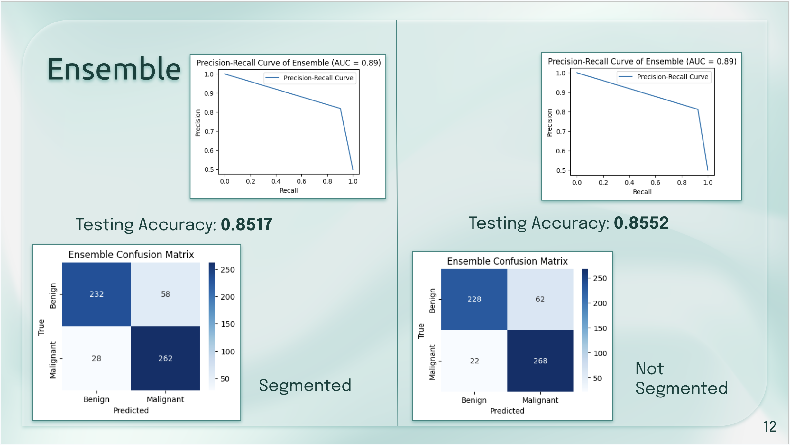

# Skin Cancer Detection: An Ensemble Strategy

Early detection of skin cancer is crucial for improving survival rates. This project aims to enhance skin cancer detection by leveraging patterns in skin lesions using Convolutional Neural Networks (CNNs). I employed the ResNet, AlexNet, VGG, and DenseNet models, utilizing an ensemble strategy to improve robustness. This repository contains the implementation of the project along with necessary scripts and instructions for replicating the results.

## Table of Contents
- [Introduction](#introduction)
- [Methodology](#methodology)
  - [Data and Preprocessing](#data-and-preprocessing)
  - [Segmentation](#segmentation)
  - [Training/Validation/Testing](#trainingvalidationtesting)
  - [Ensemble](#ensemble)
  - [Performance Evaluation](#performance-evaluation)
- [Experiments and Results](#experiments-and-results)
- [Conclusion](#conclusion)
- [Future Work](#future-work)
- [Acknowledgements](#acknowledgements)

## Introduction
Early detection of skin cancer significantly improves patient outcomes. This project focuses on enhancing skin cancer detection using CNNs to analyze dermal cell images. The goal is to improve classification accuracy by employing an ensemble of CNN models, including ResNet, AlexNet, VGG, and DenseNet. Additionally, I investigate the impact of contour-based image segmentation on model performance.

## Methodology

### Data and Preprocessing
The dataset used is [HAM10000](https://www.kaggle.com/datasets/kmader/skin-cancer-mnist-ham10000), which consists of 10,015 images of skin lesions categorized into benign and malignant. The dataset is split into training (70%), validation (15%), and testing (15%) sets using `train_test_split` from `sklearn.model_selection`.

### Segmentation
For segmentation, the `cv2` library is used to create contour images, isolating skin lesions. This method is preferred over U-Net due to better performance in this context.

### Training/Validation/Testing
Five models were trained: ResNet18, AlexNet, VGG16, DenseNet121, and ResNet152. Each model was trained with consistent parameters: batch size of 32, learning rate of 0.001, momentum of 0.9, and 25 epochs. Cross Entropy Loss was used as the criterion, and Stochastic Gradient Descent as the optimizer.

### Ensemble
An ensemble method was used to combine the predictions of ResNet18, AlexNet, VGG16, and DenseNet121. Each model's output was weighted according to its testing accuracy. The ensemble aimed to enhance robustness and accuracy.

### Performance Evaluation
Performance was evaluated using testing accuracies and the Area Under the Curve (AUC) of the Precision-Recall (PR) curve. The PR curve plots precision against recall, providing a comprehensive evaluation of the model’s effectiveness.

## Experiments and Results
The ensemble outperformed most individual models for both segmented and non-segmented data. ResNet152 achieved comparable results to the ensemble, indicating strong detection capabilities. The segmentation slightly lowered accuracy, possibly due to the loss of important lesion details during contouring.

### Key Findings
- Segmentation did not significantly improve accuracy.
- ResNet152 outperformed the ensemble in some cases.
- Data imbalance posed a significant challenge, addressed by undersampling benign images.

## Conclusion
The ensemble method improved the robustness and accuracy of skin cancer detection models. However, segmentation did not provide significant benefits, and ResNet152 showed strong performance on its own. Future work could explore other segmentation methods and ensemble strategies to further enhance detection accuracy.

## Future Work
Future iterations could address segmentation issues by exploring other methods to accurately identify lesions. Additionally, experimenting with different ensemble strategies and model parameters could improve performance.

## Acknowledgements
Special thanks to Dr. Pickering for providing critical feedback and 6.8301 Staff for their support throughout the project.

